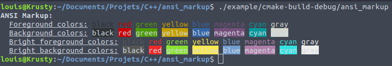

# ANSI Markup
A header only C++ library for terminal markup.  

## Install
Copy __ansi_markup.hpp__ into your projects directory.

## Usage 
```cpp
#include <iostream>

#include "../../include/ansi_markup.hpp"

namespace am = ansi_markup;


int main()
{
    std::cout << am::bold("ANSI Markup:") << "\n";

    std::cout << "  " << am::underline("Foreground colors:");
    std::cout << " " << am::black("black") << " " << am::red("red") << " " << am::green("green");
    std::cout << " " << am::yellow("yellow") << " " << am::blue("blue");
    std::cout << " " << am::magenta("magenta") << " " << am::cyan("cyan") << " " << am::gray("gray") << "\n";

    std::cout << "  " << am::underline("Background colors:");
    std::cout << " " << am::bg_black("black") << " " << am::bg_red("red") << " " << am::bg_green("green");
    std::cout << " " << am::bg_yellow("yellow") << " " << am::bg_blue("blue");
    std::cout << " " << am::bg_magenta("magenta") << " " << am::bg_cyan("cyan") << " " << am::bg_gray("gray") << "\n";

    std::cout << "  " << am::underline("Bright foreground colors:");
    std::cout << " " << am::fgB_black("black") << " " << am::fgB_red("red") << " " << am::fgB_green("green");
    std::cout << " " << am::fgB_yellow("yellow") << " " << am::fgB_blue("blue");
    std::cout << " " << am::fgB_magenta("magenta") << " " << am::fgB_cyan("cyan") << " " << am::fgB_gray("gray") << "\n";

    std::cout << "  " << am::underline("Bright background colors:");
    std::cout << " " << am::bgB_black("black") << " " << am::bgB_red("red") << " " << am::bgB_green("green");
    std::cout << " " << am::bgB_yellow("yellow") << " " << am::bgB_blue("blue");
    std::cout << " " << am::bgB_magenta("magenta") << " " << am::bgB_cyan("cyan") << " " << am::bgB_gray("gray") << "\n";
    
    return 0;
}
```

Running it will output:




## Example
See the __example__ directory.  

Compile and run each example with:  
```bash
mkdir -p build
cd build
cmake ../
make
./table
```
